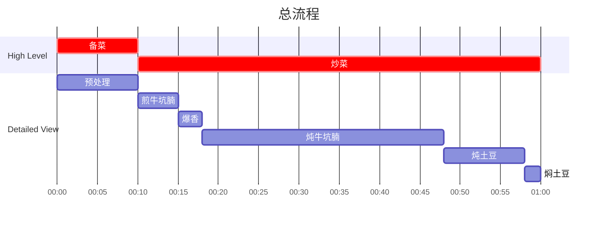

## Author

Post: JQ
Recipe: 77

## 成品

\

## 用时

x 小时

## 配料表

1.
2.
3.

## 制作过程

### 流程

```mermaid
gantt
    title 总流程
    dateFormat  HH:mm
    axisFormat %H:%M
    section High Level
    备菜               :crit, a, 00:00, 10m
    炒菜               :crit, b, after a, 50m

    section Detailed View
    预处理             :a1, 00:00, 10m
    煎牛坑腩           :a2, after a1, 5m
    爆香              :a3, after a2, 3m
    炖牛坑腩           :a4, after a3, 30m
    炖土豆             :a5, after a4, 10m
    焖土豆             :a6, after a5, 2m

```

### 文字版

1.
2.
3.
