## Author

Post: JQ
Recipe: 77

## 成品

## 用时

1 小时

## 配料表

1. 土豆 1 个
2. 牛坑腩（去骨牛肋排，Boneless Beef Short Ribs）500g - 1000g
3. 牛角椒 2 个
4. 青花椒 10g ，葱少量，姜 10g，蒜三瓣（可选），豆瓣酱 30g （3-4 teaspoon）

## 制作过程

### 流程

```mermaid
gantt
    title 总流程
    dateFormat  HH:mm
    axisFormat %H:%M
    section High Level
    备菜               :crit, a, 00:00, 10m
    炒菜               :crit, b, after a, 50m

    section Detailed View
    预处理             :a1, 00:00, 10m
    煎牛坑腩           :a2, after a1, 5m
    爆香              :a3, after a2, 3m
    炖牛坑腩           :a4, after a3, 30m
    炖土豆             :a5, after a4, 10m
    焖土豆             :a6, after a5, 2m

```

### 文字版

1. 土豆削皮，滚刀切成 3cm 左右直径的块，泡水备用。
2. 姜削皮，切成 1cm 左右的方块备用。
3. 葱取葱青，切成葱花备用。
4. 蒜剥皮切成小块备用。
5. 牛坑腩切成 3cm x 2cm x 2cm 左右的方块。
6. 平底锅加少许油，热锅加入牛坑腩，略微翻动至每面焦化，接近全熟，产生足够美拉德反应。
7. 不换锅，加少许油，加入姜蒜青花椒爆香，再加入豆瓣酱，继续加油，爆香至豆瓣酱炒出红油。
8. 加入料酒，搅动洗起糊在锅底的豆瓣酱，加入炒好牛坑腩，中火开盖炖约 30 min。
9. 加入土豆，盖上锅盖中小火再炖 10 min，至土豆可以被筷子捅动，但是土豆棱角分明没有变得很软。
10. 关火，再过5分钟等土豆自然焖熟。
11. 装盘，撒上葱花。
