## Author

Post: JQ
Recipe: 77

## 成品

## 一图流

## 用时

4 小时

## 配料表

1. English cut beef short rib 竖切牛仔骨 1000g。
2. 西芹，胡萝卜，西红柿各 1 个。
3. 红酒 100 ml。
4. Rosemary（迷迭香），Thyme（百里香）各少许。
5. Beef Stock 牛骨汤 1L。
6. 盐，黑胡椒依据口味添加。
7. 摆盘可选用甜味水果，如苹果，橙子。

## 制作过程

### 流程

```mermaid
gantt
    title 总流程
    dateFormat  HH:mm
    axisFormat %H:%M
    section High Level
    备菜               :crit, a, 00:00, 30m
    烤箱               :crit, b, after a, 3h
    收尾               :crit, c, after b, 5m

    section Detailed View
    预处理             :a1, 00:00, 15m
    煎牛仔骨           :a2, after a1, 5m
    熬制底汤           :a3, after a2, 10m
    烤箱处理           :b1, after a, 3h
    收汁              :c1, after b, 5m

```

### 图文步骤

1. 盐和黑胡椒腌制牛仔骨 10 分钟。
   
2. 西芹，胡萝卜切段备用，西红柿去皮切块备用。
3. 取一平底锅，油温 6 成热下入牛仔骨，煎至外表焦化，取出备用。
   
   
4. 另取一锅，放入切好的西芹，胡萝卜，西红柿，炒制西红柿化开，然后加水没过。
   
   
5. 开锅后加入红酒，Rosemary 和 Thyme，煮两三分钟。
   
6. 烤箱预热 $ 275 \degree F$ / $135\degree C$。
7. 换一口深一点的锅，加入煎好的牛仔骨，加入牛骨汤，盖盖煮一小会，无需开锅。
   
8. 锅带盖放入烤箱，定时 3h。
9. 3h 后取出牛仔骨，过滤汤汁，去除上层油脂，小火收汁成酱。
10. 将酱汁淋在装盘的牛仔骨上即可食用。
    
