## Author

Post: JQ
Recipe: 77

## 成品



## 用时

2 小时制作
12 小时等待

## 配料表

1. 羊腿 4 根。
2. 紫洋葱 1 个。
3. 姜 100g。
4. 料酒 200 ml。
5. 生抽 40 ml，约和料酒5：1。
6. 小米椒 3 个。

## 制作过程

### 流程

```mermaid
gantt
    title 总流程
    dateFormat  HH:mm
    axisFormat %H:%M
    section High Level
    预处理                      :crit, a, 00:00, 15m
    腌制                        :crit, b, after a, 12h
    烤制                        :crit, c, after b, 50m

    section Detailed View
    切洋葱/姜                   :a1, 00:00, 5m
    打碎原料                    :a2, after a1, 5m
    洗净羊腿                    :a3, 00:00, 5m
    装袋腌制                    :a4, after a2 a3, 5m
  
    取出羊腿装烤盘               :c1, after b, 5m
    350℉ 烤 30分钟              :c2, after c1, 30m
    翻面，350℉ 烤 15分钟         :c3, after c2, 15m
    500℉ 烤 5分钟上脆            :c4, after c3, 5m


```

### 文字版

1. 准备新鲜羊腿 4 个，最好不要买泡在血水中的那种，会比较腥臭。干燥保存的羊腿没有什么异味。
2. 紫洋葱 1 个，去外皮切四瓣备用。
3. 姜一大块约 100g，去皮备用。
4. 洋葱和姜加入搅拌机，倒入一半高度料酒，再倒入约料酒  \frac{1}{5}  的生抽。
5. 将所有材料搅拌至没有大块即可，不需要非常精细。
6. 取一个大号可封口食品袋，放入洗好的羊腿，再倒入搅拌好的腌料，挤出袋中空气，放入冰箱腌制 12 小时。注意，食品袋可能漏水，建议垫个盘子或者塑料盒。
7. 12 小时后，准备一个烤盘，铺上锡箔纸，将羊腿平行摆放，留有一定间距。烤箱预热 350℉ （约 180℃ ）。选择 bake 而不是 broil。
8. 预热完毕后放入羊腿，烤 30-40 分钟后翻面，再烤 15 分钟至两面完全熟透且完全变色。翻面标准是羊腿上面完全没有粉色。
9. 再次翻面，将烤箱设置为 broil，500℉ (260℃)或更高烤制 5 分钟即可出炉。
10. 摇摇羊腿制作：将烤羊腿晾凉至不烫手，放入干净的食品袋，加入烤串料，摇动至羊腿均匀沾上烤串料即可食用。
