## Author

Post: JQ
Recipe: JQ

## 成品

注：照烧鸡腿部分不在此菜谱中，请参考日式煎鸡腿。

## 用时

20 分钟

## 配料表

1. 火锅肥牛片 500g，提前解冻
2. 洋葱半个
3. 味啉 15 ml
4. 清酒 （或者白料酒） 50 ml
5. 万字酱油 约 20 ml，依据口味添加
6. 鲣鱼粉 （Hondashi Powder）5g
7. 日式拌饭撒料 可选
8. 西兰花胡萝卜配菜 可选

### 额外工具
煮面漏网

## 制作过程

### 流程

```mermaid
gantt
    title 总流程
    dateFormat  HH:mm
    axisFormat %H:%M
    section High Level
    备菜               :crit, a, 00:00,5m
    煮菜               :crit, b, after a, 15m
    

    section Detailed View
    切洋葱             :a1, 00:00, 5m
    烧水              :a2, after a1, 5m
    炒洋葱            :a3, after a1, 5m
    煮肥牛             :a4, after a2 a3, 10m
    用另一个锅焯配菜     :a5, after a2, 5m

```

### 文字版

1. 洋葱切丝，用炒锅翻炒均匀备用。
2. 烧两锅水，一锅用来煮牛肉，一锅用来焯配菜。煮牛肉的锅建议深一点但是口径不要太大，适合使用小奶锅。蔬菜烫约1分钟即可出锅。
3. 在煮牛肉的锅中加入味啉，清酒，万字酱油，鲣鱼粉。
4. 使用煮面漏网，加入少量炒好洋葱，再加入少量肥牛，放入煮牛肉的锅中不断用筷子搅动，约30秒即可出锅。
5. 重复步骤 4，直到洋葱和牛肉用完。
6. 撇去煮锅上层浮沫，取一定量底汤备用。
7. 米饭上铺好肥牛，点缀配菜，浇上底汤，撒上拌饭撒料即可食用。
