## Author

Post: JQ
Recipe: JQ

## 成品

## 用时

45 分钟 (含煮饭)

15 分钟（不含煮饭）

## 配料表

1. 火锅肥牛片 500g，提前解冻
2. 洋葱半个
3. 油葱酥 10g
4. 味啉 15 ml
5. 清酒 （或者白料酒） 50 ml
6. 万字酱油 约 20 ml，依据口味添加
7. 鲣鱼粉 （Hondashi Powder）5g，依据口味添加
8. 日式拌饭撒料 可选
9. 西兰花胡萝卜配菜 可选

### 额外工具

煮面漏网

## 制作过程

### 流程

```mermaid
gantt
    title 总流程
    dateFormat  HH:mm
    axisFormat %H:%M
    section High Level
    煮饭               :crit, c, 00:00,45m
    备菜               :crit, a, 00:30,5m
    煮菜               :crit, b, after a, 10m
  

    section Detailed View
    切洋葱             :a1, 00:30, 5m
    洗切西兰花          :b1, 00:30, 5m
    烧水并调味          :a2, 00:30, 5m
    煮洋葱             :a3, after a2, 5m
    煮肥牛             :a4, after a2 a3, 5m
    微波炉加热西兰花     :b2, after b1, 2m

```

### 文字版

1. 洋葱切丝备用。
2. 西兰花保留花洗净，胡萝卜去皮切片。
3. 西兰花胡萝卜放入碗中，盖盖微波炉大火加热1.5分钟，至半生即可。注意余热会让菜花继续变熟，可以盖盖焖一会再拿出来。如果还是太生可以改为2分钟。
4. 烧水，锅建议深一点但是口径不要太大，适合使用小奶锅。
5. 在煮牛肉的锅中加入味啉，清酒，万字酱油，鲣鱼粉。不用等水开，直接加入洋葱和油葱酥，开锅后继续等5分钟。
6. 提前装好米饭碗。
7. 使用煮面漏网，加入少量肥牛，放入煮牛肉的锅中不断用筷子搅动，约30秒即可出锅装碗。此时洋葱在汤中，漏网下面，不要急着捞。
8. 重复步骤7，直到牛肉煮完。
9. 捞一些锅里的洋葱装碗。
10. 撇去煮锅上层浮沫，取一定量底汤浇入碗中。也可以大火开锅时从中间捞取清汤。
11. 将配菜加入米饭碗中，摆盘即可食用。
