## Author

Post: JQ
Recipe: JQ

## 成品

## 用时

2 小时

## 配料表

1. 牛排一块，可以选择 Rib Eye （肋眼牛排），New York Strip （不知道叫啥），带不带骨头皆可，水浴不会出现带骨头不好煎熟的问题。
2. Rosemary （迷迭香） 一棵。
3. 黄油一块。
4. 蒜两瓣。
5. 盐少许，海盐更佳。
6. 现磨黑椒依据个人口味添加，可以用黑椒粉替代。现磨黑椒味道更浓。
7. (可选)配菜，可以用 Asparagus（芦笋）/西兰花/玉米粒/胡萝卜等等。芦笋直接炒熟，其他蒸熟/煮熟即可。

## 额外工具

 

## 制作过程

### 流程

```mermaid
gantt
    title 总流程
    dateFormat  HH:mm
    axisFormat %H:%M
    section High Level
    预处理              :crit, a, 00:00, 10m
    水浴               :crit, b, after a, 2h
    上锅煎               :crit, c, after b, 5m

    section Detailed View
    装袋             :a1, 00:00, 10m
    55度水浴         :b1, after a, 2h
    每面煎至焦化，约30秒至1分钟 :c1, after b, 5m

```

### 文字版

1. 牛排两面撒盐和黑胡椒，与黄油、蒜、Rosemary 一起放入真空袋中抽真空备用。
2. 水浴锅开到 $55\degree C$，冷水放入牛排，至水温恒定后水浴 2h。
3. 水浴过程中检查一下黄油是否分散，如果不够分散可以手动挤一挤黄油。
4. 水浴完成后取出牛排，其余部分丢弃。
5. 取一平底锅烧热油，7成热下牛排，每面煎30秒至1分钟，至表面完全焦化。建议单独将侧面也煎一下，侧面油脂较多，提升香味。
6. 加入配菜即可食用。
