## Author

Post: JQ
Recipe: 77

## 成品

## 用时

1 小时

## 配料表

1. 鱿鱼须 50g。
2. 贻贝和蛤（Mussels and clams）各约 5 个。
3. 鲜虾 100g，可以用虾仁。
4. 青红椒 50g。
5. 洋葱半个。
6. 樱桃番茄10个/大番茄一个。
7. 蒜两瓣，切末。
8. 白葡萄酒 50ml。
9. 罗勒叶 （Basil）适量。
10. 新鲜的粉状 Parmesan （不知道中文是啥） 30g。

## 制作过程

### 流程

```mermaid
gantt
    title 总流程
    dateFormat  HH:mm
    axisFormat %H:%M
    section High Level
    备菜               :crit, a, 00:00, 30m
    烩面               :crit, b, after a, 20m

    section Detailed View
    煮意面             :a1, 00:00, 15m
    煮熟所有贝类        :a2, 00:00, 15m
    贝类去壳           :a3, after a2, 15m
    收汁               :a4, after a2, 10m
    新鲜虾去壳          :a5, 00:00, 10m
    罗勒切成末          :a6, 00:00, 2m
    青红椒切丝          :a7, 00:00, 2m
    番茄切丁            :a8, 00:00, 2m
    蒜切成末            :a9, 00:00, 2m

    炒蒜，洋葱，番茄           :b1, after a1 a2 a3 a4 a5 a6, 5m
    加入意面，贝类             :b2, after b1, 5m
    加入煮完贝类的汁，白葡萄酒   :b3, after b2, 1m
    加入虾仁，煮至断生          :b4, after b3, 5m
    加入青红椒                :b5, after b4, 1m
    煮两分钟                 :b6, after b5, 2m
    加入 Parmesan 粉         :b7, after b6, 1m
    搅匀出锅                 :b8, after b7, 1m
    撒罗勒叶                 :b9, after b7, 1m


```

### 文字版

1. 意面提前煮好，开水下锅煮约7-15分钟，根据面的种类和粗细以及所需口感控制。这一步建议煮至微硬，煮熟但是略硬。煮好沥干备用。
2. 贝类洗刷干净表面，提前吐好沙，准备一个煮锅加入刚好没过贝类的水，煮10-15分钟。
3. 贝类出锅，撬开所有贝壳，去掉内脏，取出贝肉备用。煮完贝类的水取出一部分继续收汁备用。
4. 新鲜的虾去头去壳去虾线，可以用虾仁替代但是风味有所损失。
5. 蒜切成末备用。
6. 罗勒切末备用。
7. 青红椒去瓤切丝备用。
8. 番茄切成丁备用。
9. 取一平底锅，热锅冷用，下入蒜，洋葱，炒香，再下入番茄，继续炒香。
10. 加入煮好沥干意面和贝类，生虾仁，加入收完汁的煮贝水，白葡萄酒，煮 5 分钟至虾仁断生。
11. 加入青红椒，搅拌一下再煮一两分钟。
12. 加入 Parmesan 粉末，轻轻搅拌均匀出锅，撒上罗勒叶即可食用。
