## Author

Post: JQ
Recipe: 77

## 成品

## 用时

约 1.5 小时 （高压锅约 1 小时 20 分钟，普通锅约 2 小时）

## 配料表

1. 小排骨 500g。可选棒骨/扇骨。
2. 冬瓜 500g。
3. 竹笙一袋。
4. 大葱一根。
5. 姜 50g，切成正方体丁。 
6. 白胡椒粉适量，盐按口味添加，味精少量。

## 制作过程

### 流程

```mermaid
gantt
    title 总流程
    dateFormat  HH:mm
    axisFormat %H:%M
    section High Level
    备菜               :crit, a, 00:00, 30m
    炒排骨             :crit, b, after a, 10m
    炖汤               :crit, c, after b, 45m

    section Detailed View
    洗排骨             :a1, 00:00, 5m
    洗竹笙             :a2, 00:00, 5m
    洗/切冬瓜           :a3, 00:00, 5m
    洗/切葱姜           :a4, 00:00, 5m
    泡排骨              :a5, after a1, 20m
    沥干排骨            :a6, after a5, 5m

    炒排骨              :b1, after a6, 10m
    烧水                :b2, after a6, 5m
    下排骨，姜，葱        :b3, after b1 b2, 1m
    高压锅炖 20 分钟，普通锅炖 40 分钟        :b4, after b1 b2, 30m
    下竹笙，冬瓜          :b5, after b4, 1m
    开盖炖 15 分钟           :b6, after b4, 15m


```

### 文字版

1. 排骨泡水，洗净血水，控干备用。
2. 葱切段，留少部分葱青切成葱花备用。
3. 姜切成小块备用，可以适当多放姜。
4. 竹笙去掉全部絮状部分，去除尾部的硬梗，泡水备用。未处理好的竹笙炖汤会有洗洁精味。
5. 平底锅热锅冷油，下锅适量排骨，中火将排骨两面煎至焦化，锅不够大可以分批处理，切勿一锅放超过一层排骨。
6. 深锅/高压锅烧水，放入葱姜，排骨，盖盖炖 20 （高压锅）/ 40 （普通锅）分钟。
7. 加入盐和白胡椒和味精调味，然后加入竹笙和冬瓜，炖 10-15 分钟即可出锅。
