## Author

Recipe: Sheron

## 成品

有空再拍

## 用时

0.5 小时 （处理+烤制鸡胸约 25 分钟，制作酱汁约 10 分钟）

## 配料表

1. 鸡胸肉（换成鸡翅鸡腿也完全 ok）
2. 蒜粉
3. 洋葱粉
4. 芒果哈瓦那辣酱 Mango Habanero Sauce
5. 黄油
6. 糖（备选）
7. 辣椒粉（备选）

## 制作过程

### 流程

```mermaid
gantt
    title 总流程
    dateFormat  HH:mm
    axisFormat %H:%M
    section High Level
    预制    :crit, a, 00:00, 25m
    制作    :crit, b, 00:20, 10m

    section 预制
    预处理           :a1, 00:00, 5m
    烤鸡胸           :a2, after a1, 20m

    section 制作
    混合酱汁        :b1, 00:20, 5m
    加热           :b2, after b1, 5m
```

注：该流程图展示的是「一次性制作」的流程，实操中可在预制阶段制作大量烤鸡胸冷藏，食用时直接参考制作阶段。

### 文字版

#### 预制

1. 鸡胸肉切成鸡柳串大小，如果买回来的已经是条装就不用切了
2. 鸡胸肉放进烤盘，撒蒜粉和洋葱粉均匀涂抹双面
3. 烤箱 400 华氏度加热约 20 分钟，如果鸡胸切得比较厚，可以中间进行一次反面
4. 20 分钟后从烤箱里拿出来，留下本次要吃的分量，剩下的放入冰箱；冷藏可以保存接近一个周，但如果一时半会用不上还是建议冷冻

#### 制作

1. 很多黄油热锅，然后往锅里加芒果哈瓦那辣酱
2. 根据自己的口味对哈瓦那辣酱进行调味：大多数情况下，想要接近餐馆的口感，至少要加入一部分糖调味；以笔者使用的 Whole Foods 贴牌 Mango Habanero Coconut Sauce 为例，原本的酱汁不够辣，还要加入辣椒粉，不建议使用美国本土的辣椒粉，不够辣，但也别加五香粉之类的，花椒孜然什么的加进芒果酱里味道非常怪。
3. 待酱汁加热到透明琥珀色后加入鸡胸肉，均匀加热几分钟即可

注：不建议将这一步得到的鸡胸芒果酱混合物放入冰箱冷藏，因为芒果酱会让鸡胸出汁流失水分；酱汁冷却后色泽会变浑浊，生吃口感会变差
