## Author

Post: JQ
Recipe: 77

## 成品

## 用时

20 分钟

## 配料表

1. 羊肉片 500g，提前解冻。
2. 大葱 500g，歇着切成段，每段约 2-3 cm。
3. 姜 10g，切丝。
4. 花椒 5g，青花椒大红袍花椒均可。
5. 白糖 5g，生抽适量，依据口味调节，十三香粉（可用孜然粉替代）适量，料酒10ml，白胡椒粉适量。

## 制作过程

### 流程

```mermaid
gantt
    title 总流程
    dateFormat  HH:mm
    axisFormat %H:%M
    section High Level
    备菜               :crit, a, 00:00, 5m
    炒菜               :crit, b, after a, 15m

    section Detailed View
    洗葱/切葱段             :a1, 00:00, 5m
    洗姜/切姜丝             :a2, 00:00, 5m
    爆香姜/花椒             :a3, after a2, 2m
    炒羊肉片至出水           :a4, after a3, 5m
    加入调料，搅匀起锅        :a5, after a4, 2m
    另起锅炒葱爆香           :a6, after a5, 3m
    加入炒好羊肉，继续翻炒收汁 :a7, after a6, 3m
```

### 文字版

1. 提前解冻羊肉片。
2. 大葱洗净去根斜向切成葱段，约 2-3 cm 长。
3. 姜洗净去皮切成细丝。
4. 热锅热油，加入姜丝和花椒，爆香。
5. 加入羊肉片，炒至羊肉片完全熟透，并且不再出水。
6. 加入糖，料酒，生抽，十三香，白胡椒粉，搅拌均匀，起锅。
7. 不用洗锅，重新倒油，至油温6成热加入葱段，继续爆香至葱完全缩水。
8. 加入炒好的羊肉片，搅拌均匀，检查一下调味即可出锅。
