## Author

Post: JQ
Recipe: 77

## 成品

## 用时

30 分钟制作
30 分钟等待

## 配料表

1. 新鲜牛仔骨 1000g
2. 黑椒粉 10g
3. 红洋葱 0.5-1 头
4. 彩椒 可选 1 个
5. 西兰花 可选 少许
6. 黑椒汁配料：蚝油 0.5 teaspoon，生抽 0.5 teaspoon，水 50ml，淀粉少许，糖 1 teaspoon，研磨黑椒粉（grind black pepper） 20g

## 制作过程

### 流程

```mermaid
gantt
    title 总流程
    dateFormat  HH:mm
    axisFormat %H:%M
    section High Level
    备菜               :crit, a, 00:00, 10m
    腌制牛肉            :crit, b, after a, 30m
    炒菜               :crit, c, after b, 20m

    section Detailed View
    预处理             :a1, 00:00, 10m
    腌制牛肉           :a2, after a1, 30m
    炒牛仔骨           :a3, after a2, 10m
    加洋葱             :a4, after a3, 5m
    加黑椒汁收汁        :a5, after a4, 5m

```

### 文字版

1. 请直接购买厚度约 0.5-1cm的牛仔骨，砍断中间骨头，切成每块有半块骨头备用。
2. 牛仔骨加入黑椒，生抽腌制约 1 小时。
3. 洋葱切丝备用。
4. 调制黑椒汁：蚝油 0.5 teaspoon，生抽 0.5 teaspoon，水 50ml，淀粉少许，糖 1 teaspoon，研磨黑椒粉（grind black pepper） 20g
5. 使用平底锅，宽油，热锅冷油下腌好牛仔骨，提前沥干不要带水下锅。
6. 牛仔骨中火翻炒约 5-10 min 至产生足够焦化后，加入洋葱，继续中火翻炒至洋葱半生。如有可选材料比如彩椒，在炒完洋葱后加入。
7. 加入黑椒汁，中火略微收汁，即可装盘。西兰花等配菜焯水直接装盘，无需下锅。
